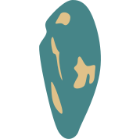

## Charm - Sass Framework
<p align="center">
  
</p>

**Charm** adds a new, expressive language to your stylesheets while providing quick access to many common stylings.

This is accomplished through a [concise API](docs/index.md) which make your stylesheets easily readable and maintainable.

- Typographic layouts
- Flexbox implementation
- Element groups
- Builder tools for common styling

Built-in resets standardize results across all browsers, this includes completely replacing the select arrow.

<p>
  
</p>

**Charm** comes with a [pleasing and extensible default styling](https://charmingsass.com/defaults.html).

#### Sample Usage
```sass
@import charm/charm

+set-heading-ratio(minor3)
+set-line-heights(1.55em)
+set-font-weights(semi-bold, thin)

+fix(header, top, 5em)
  +flat(between, center)

body
  font-size: 1em
  +font-family(Raleway)

+headings
  margin: 1rem
  +underline

section
  +stack(between)
  +media(min, small)
    +flat-wrap(around, center)
  p
    font-size: .9em
    +media(landscape)
      font-size: 1.1em

article
  +scroll(5em)
```

## Installation
### .sass/scss
1. Download [`charm.zip`](https://github.com/asvln/charm/releases) or clone to your project's SASS folder

```bash
git clone https://github.com/asvln/charm
```

2. Import `charm/charm` into your main SASS/SCSS file

```sass
@import charm/charm
```

3. **Charm** is now accessible

```sass
+font-response
```

### .css
1. Download [`charm.min.css`](https://github.com/asvln/charm/blob/master/css/charm.min.css)

2. Import the .css file

```html
<link rel="stylesheet" href="css/charm.min.css">
```


## Documentation
Documentation can be found in `charm/docs`

## Sponsor
[Sponsors](https://patreon.com/charmingsass) help support the creation of new features such as...

- Color scheming
- Grid system
- Specialized elements
- Class implementations

API will be stable upon v1.0.0 release.

## License
This project is licensed under the MIT License
